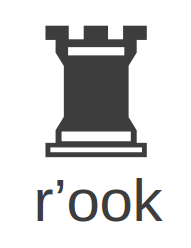
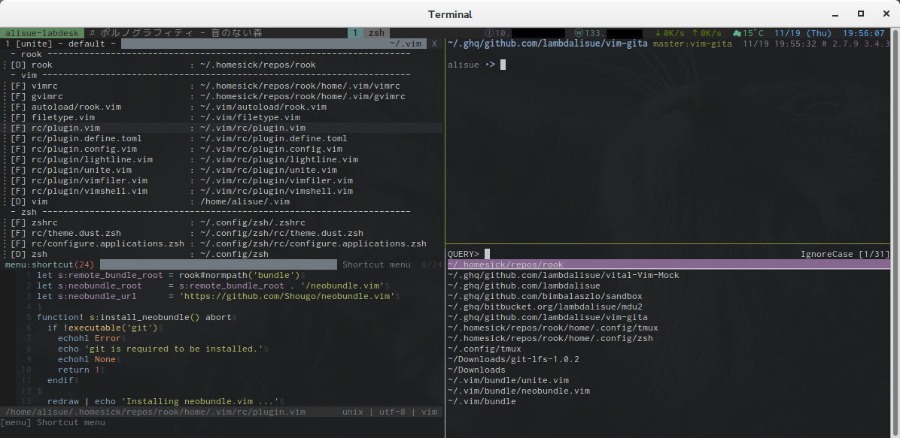

<div align="center" style="text-align: center">
  
</div>

This is a personal castle repository of [homeshick](https://github.com/andsens/homeshick) which Alisue use.
As long as you don't disturb me, you can refer or use this on your own responsibility but you won't get any kinds of help from me ;-)



Install
=======================

```sh
# clone homeshick, rook and install them
curl -L http://goo.gl/IrTY7b | bash
curl -L http://goo.gl/IrTY7b | USE_GUEST=1 bash
```

Programs configured
=======================

- zsh
- tmux
- git
- vim
- neovim
- peco
- latexmk (TexLive)
- matplotlib
- vimperator

